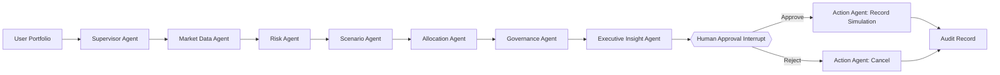

# Agentic Treasury & Portfolio Risk Intelligence Platform

> **LangGraph + Streamlit + Gemini + yfinance + Plotly** — an interview-ready agentic AI application that turns a portfolio into a governed, human-approved treasury/risk workflow.

This project is a Streamlit reimplementation and enterprise-oriented extension of the **full-stack stock portfolio agent** pattern discussed in the CopilotKit / LangGraph AG-UI project. Instead of a React frontend, this repository uses **Streamlit** and adds explicit risk analytics, stress testing, governance guardrails, a genuine LangGraph human-in-the-loop interrupt, downloadable audit logs, CI tests and Docker support.

**Important:** The application is educational software. It does **not** place trades, connect to a broker, or provide individualized investment advice.

---

## Why this is an Agentic AI project

This is not a single prompt wrapped in a dashboard. A LangGraph state machine coordinates specialized agents that each own part of the decision workflow:



The **Human Approval Agent** calls LangGraph `interrupt()` and the graph remains paused until Streamlit resumes the same thread with `Command(resume=True|False)`. That is a real checkpointed HITL workflow rather than a UI-only button.

---

## Core capabilities

- **Interactive portfolio editor** — add/remove tickers and weights in Streamlit.
- **Live historical market data** — downloads adjusted price history through `yfinance`.
- **Portfolio risk engine** — annualized return/volatility, Sharpe, Sortino, historical VaR/CVaR, max drawdown, beta, HHI and effective number of positions.
- **Stress-testing agent** — transparent beta/volatility-sensitive market crash, recession, risk-off and bull-recovery scenarios.
- **Allocation agent** — capped inverse-volatility blend tailored to Conservative / Balanced / Growth profiles.
- **Governance agent** — concentration, HHI, data-quality and history-sufficiency controls.
- **Optional Gemini executive agent** — evidence-grounded executive summary using only computed facts.
- **No-key fallback** — the application remains usable without an LLM API key.
- **Human approval** — approve/reject the simulated allocation proposal at a real LangGraph interrupt.
- **Audit trail** — download a JSON record containing inputs, metrics, guardrails, approval status and agent trace.
- **Interactive Plotly dashboard** — performance, correlation, allocation and scenario views.
- **Automated tests + GitHub Actions CI**.
- **Dockerized deployment**.

---

## Tech stack

| Layer | Technology |
|---|---|
| UI | Streamlit 1.62 |
| Agent orchestration | LangGraph 1.2 |
| LLM (optional) | Google Gemini via `langchain-google-genai` |
| Market data | yfinance 1.6 |
| Analytics | Pandas, NumPy |
| Visualization | Plotly |
| HITL | LangGraph `interrupt()` + `Command(resume=...)` |
| State/checkpointing | LangGraph `InMemorySaver` + DataFrame-compatible serializer |
| Testing | Pytest |
| Packaging/deployment | Docker + GitHub Actions |

---

## Repository structure

```text
agentic-treasury-intelligence/
├── app.py                         # Streamlit application
├── data/
│   └── sample_portfolio.csv       # Demo input
├── src/
│   ├── agents.py                  # Specialized LangGraph agent nodes
│   ├── allocation.py              # Target allocation + rebalance simulation
│   ├── compliance.py              # Governance controls
│   ├── config.py                  # Environment configuration
│   ├── graph.py                   # LangGraph topology and checkpointer
│   ├── llm.py                     # Gemini + deterministic fallback
│   ├── market_data.py             # yfinance integration
│   ├── reporting.py               # Audit record generation
│   ├── risk.py                    # Risk analytics
│   ├── scenarios.py               # Stress testing
│   └── state.py                   # Typed graph state
├── tests/
│   ├── test_risk.py
│   └── test_allocation_scenarios.py
├── docs/
│   ├── ARCHITECTURE.md
│   ├── DEPLOYMENT.md
│   └── INTERVIEW_GUIDE.md
├── .github/workflows/ci.yml
├── .streamlit/config.toml
├── .env.example
├── Dockerfile
├── Makefile
├── requirements.txt
└── LICENSE
```

---

## Quick start

### 1) Clone and create a virtual environment

```bash
git clone <your-repository-url>
cd agentic-treasury-intelligence
python -m venv .venv
```

Windows:

```powershell
.venv\Scripts\activate
```

macOS/Linux:

```bash
source .venv/bin/activate
```

### 2) Install dependencies

```bash
pip install -r requirements.txt
```

### 3) Optional: enable Gemini

The app works without an API key. To enable the LLM-based **Executive Insight Agent**, copy `.env.example` to `.env`:

```bash
cp .env.example .env
```

Then set:

```env
GOOGLE_API_KEY=your_key_here
GOOGLE_MODEL=gemini-3.7-flash
```

On Streamlit Community Cloud, store the key in app secrets/environment variables instead of committing `.env`.

### 4) Run

```bash
streamlit run app.py
```

Open the local Streamlit URL, edit the sample portfolio, and click **Run Agentic Analysis**.

---

## Portfolio CSV format

```csv
ticker,weight
MSFT,25
JPM,20
GOOGL,20
PG,15
XOM,10
TLT,10
```

Weights do not have to total exactly 100; the application normalizes positive weights automatically.

Yahoo Finance ticker conventions apply. Examples:

- US: `MSFT`, `JPM`, `SPY`
- India: `RELIANCE.NS`, `HDFCBANK.NS`, `INFY.NS`

---

## Agent responsibilities

### 1. Supervisor Agent
Validates the request and initializes the specialist-agent workflow.

### 2. Market Data Agent
Fetches adjusted historical prices, aligns timestamps, computes return inputs and optionally gathers recent ticker headlines.

### 3. Risk Agent
Computes:

- CAGR-like annualized historical return
- annualized volatility
- Sharpe and Sortino ratios
- historical 95% VaR and CVaR
- maximum drawdown
- benchmark beta
- HHI / effective number of positions
- average cross-asset correlation

### 4. Scenario Agent
Runs transparent analytical stress proxies. These are **not forecasts**. Each scenario combines historical beta and volatility sensitivity.

### 5. Allocation Agent
Creates a proposed target allocation by blending current weights with inverse-volatility weights and applying profile-specific concentration caps.

### 6. Governance Agent
Checks:

- weights sum to 100%
- maximum position size
- portfolio HHI concentration
- sufficient historical observations
- market-data warnings

### 7. Executive Insight Agent
If Gemini is available, it receives only structured computed facts and writes a short management brief. If Gemini is unavailable, deterministic fallback logic produces the brief.

### 8. Human Approval Agent
Pauses the LangGraph workflow using `interrupt()` and exposes the proposal to Streamlit. The same LangGraph thread is resumed with a human decision.

### 9. Action Agent
Records approval/rejection of the **simulation only**. No broker connection exists.

---

## Risk methodology

See [`docs/ARCHITECTURE.md`](docs/ARCHITECTURE.md) for formulas and detailed design assumptions.

Key principle: **LLMs do not calculate portfolio risk.** Quantitative metrics are calculated deterministically in Python. The LLM is restricted to synthesis of structured outputs.

This separation improves reproducibility and reduces hallucination risk.

---

## Human-in-the-loop design

The approval node sends a JSON-serializable payload to LangGraph:

```python
approved = interrupt({
    "question": "Approve the simulated rebalance proposal?",
    "proposal": state["rebalance_plan"],
})
```

Streamlit receives the paused result under `__interrupt__`. The user then resumes the same thread:

```python
graph.invoke(Command(resume=True), config=config)
```

or rejects it:

```python
graph.invoke(Command(resume=False), config=config)
```

For this demo, the in-memory checkpointer uses LangGraph `JsonPlusSerializer(pickle_fallback=True)` because the graph state contains Pandas DataFrames. For a production system, replace `InMemorySaver` with durable persistence and a hardened serialization/security policy.

---

## Run tests

```bash
pytest -q
```

The included tests use synthetic data, so the core risk/allocation/scenario engine can be validated without Yahoo Finance.

---

## Docker

```bash
docker build -t agentic-treasury-intelligence .
docker run --rm -p 8501:8501 --env-file .env agentic-treasury-intelligence
```

Then open `http://localhost:8501`.

---

## Streamlit Community Cloud

1. Push this repository to GitHub.
2. Open Streamlit Community Cloud.
3. Create a new app from the repository.
4. Set the entry point to `app.py`.
5. Optionally add `GOOGLE_API_KEY` as a secret/environment variable.
6. Deploy.

The deterministic analytics do not require Gemini; internet access is required at runtime for Yahoo Finance market data.

---

## Enterprise extension ideas

The architecture can be extended beyond retail portfolio analytics:

### HSBC / Banking

- treasury liquidity monitoring
- counterparty exposure agents
- AML policy retrieval
- risk-limit approval workflow
- market/credit stress scenarios
- governed trade recommendation review

### Accenture Strategy

- executive decision intelligence
- AI operating-model demonstration
- scenario planning and value-at-risk dashboards
- human/agent decision-right design
- auditability and responsible-AI controls

### Vodafone Idea / Telecom

Reuse the same architecture for NOC operations:

`Network Alert → KPI Agent → Log Agent → RCA Agent → Remediation Agent → Governance → Human Approval → Simulated Action`

---

## Resume-ready framing

**Agentic Treasury & Portfolio Risk Intelligence Platform | LangGraph, Gemini, Streamlit, Python**

- Architected a LangGraph-based multi-agent treasury intelligence workflow coordinating market-data, quantitative-risk, stress-testing, allocation, governance and executive-insight agents through shared state.
- Implemented deterministic VaR/CVaR, Sharpe/Sortino, beta, drawdown, concentration and scenario analytics, separating numerical computation from LLM synthesis to improve reliability and explainability.
- Built a genuine human-in-the-loop control using LangGraph checkpointing and `interrupt()/Command(resume=...)`, enabling governed approval or rejection of simulated allocation actions with downloadable audit trails.
- Delivered an interactive Streamlit/Plotly application with optional Gemini synthesis, Docker packaging, synthetic unit tests and GitHub Actions CI.

Do not claim business-impact percentages unless you independently measure them through a controlled evaluation.

---

## Reference / inspiration

The UI/portfolio-agent idea was inspired by the open-source **AG-UI + LangGraph Stock Portfolio Agent** example:

- GitHub: https://github.com/TheGreatBonnie/open-ag-ui-langgraph
- Tutorial: https://www.copilotkit.ai/blog/build-a-fullstack-stock-portfolio-agent-with-langgraph-and-ag-ui

This repository uses an independently implemented **Streamlit architecture** and adds risk analytics, stress testing, governance, HITL checkpointing, auditability, testing and enterprise-oriented documentation.

---

## Data and legal note

`yfinance` uses publicly available Yahoo Finance interfaces and is intended for research/educational use. Review Yahoo Finance's terms before using market data for commercial or production applications.

## License

MIT
