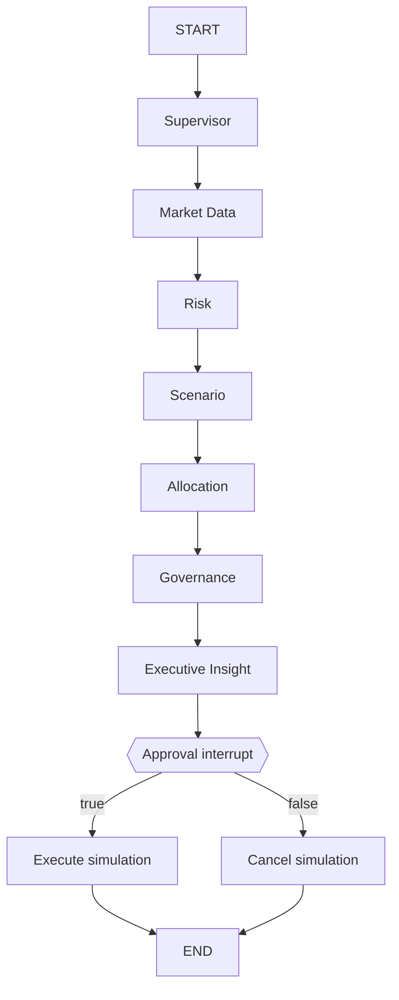

# Architecture & Methodology

## 1. Design objective

The system demonstrates an enterprise-grade **agentic decision workflow** while preserving deterministic computation for high-risk numerical tasks.

The central design rule is:

> **Agents orchestrate and interpret; deterministic Python calculates.**

An LLM can summarize risk outputs, but it never invents or calculates the portfolio metrics used by governance.

---

## 2. LangGraph state

`PortfolioState` is a typed shared state that moves through the graph. It contains:

- user inputs: tickers, normalized weights, benchmark, lookback, risk profile, objective and capital
- market data: price history, return history, latest price, optional headlines
- analytical outputs: risk metrics, correlation and stress scenarios
- decision outputs: target weights, rebalance simulation, guardrail status
- governance outputs: approval status and action result
- observability: append-only agent log and warnings

The `agent_log` and `errors` fields use list reducers so every agent can append evidence without overwriting earlier records.

---

## 3. Graph topology

The approval node uses dynamic routing via `Command(goto=...)` after the interrupt resumes.

---

## 4. Quantitative metrics

Let portfolio daily return be:

\[
r_{p,t} = \sum_i w_i r_{i,t}
\]

where weights are normalized to sum to 1.

### Annualized return

The implementation compounds observed daily returns and annualizes the cumulative growth over the number of trading-year equivalents.

### Annualized volatility

\[
\sigma_{ann} = \sigma_{daily}\sqrt{252}
\]

### Sharpe ratio

\[
Sharpe = \frac{R_p - R_f}{\sigma_p}
\]

### Sortino ratio

Same excess return numerator, but the denominator uses annualized downside volatility.

### Historical VaR (95%)

The 5th percentile of observed daily portfolio returns is converted to a positive loss magnitude.

### Historical CVaR / Expected Shortfall (95%)

Average loss among returns at or below the historical 5th percentile.

### Maximum drawdown

For cumulative wealth `W_t`:

\[
MDD = \min_t \left(\frac{W_t}{\max_{s \le t} W_s} - 1\right)
\]

### Beta

\[
\beta_p = \frac{Cov(r_p, r_m)}{Var(r_m)}
\]

### HHI concentration

\[
HHI = \sum_i w_i^2
\]

The effective number of equally-sized positions is approximated as `1 / HHI`.

---

## 5. Stress testing

The project deliberately uses **transparent stress proxies**, not black-box forecasts.

For each asset, historical beta to the benchmark estimates systematic market sensitivity. A scenario supplies a benchmark shock. Higher-volatility assets receive an additional penalty in downside risk-off scenarios.

This gives an interpretable interview narrative:

1. estimate asset sensitivity from history
2. apply a defined market scenario
3. aggregate asset impacts by portfolio weight
4. clearly label the result as a scenario proxy, not a prediction

---

## 6. Allocation proposal

The Allocation Agent calculates inverse-volatility weights:

\[
w_i^{IV} = \frac{1/\sigma_i}{\sum_j 1/\sigma_j}
\]

It then blends them with current weights. The blend varies by risk profile:

- Conservative: 80% inverse-volatility / 20% current
- Balanced: 60% inverse-volatility / 40% current
- Growth: 40% inverse-volatility / 60% current

Profile-specific position caps are applied and weights are renormalized.

This is intentionally explainable and deterministic. It is not presented as an optimizer that guarantees higher returns.

---

## 7. Governance

The Governance Agent evaluates:

- allocation total = 100%
- profile-specific max single position
- HHI concentration
- at least 60 historical observations
- market-data warnings

Core allocation failures are surfaced to the human approver rather than silently ignored.

---

## 8. Human-in-the-loop

LangGraph's checkpointer stores state at the interrupt boundary. The thread ID acts as the cursor for the run.

The application uses `InMemorySaver` because it is a portfolio demo and works naturally with Streamlit's cached resource lifecycle. Because graph state contains Pandas DataFrames, the saver is configured with `JsonPlusSerializer(pickle_fallback=True)`, which is the LangGraph-documented fallback for DataFrames. Pickle-based deserialization should only be used with trusted checkpoint data. Production alternatives should use durable persistence plus a hardened serializer and storage boundary.

No real external transaction is attached to the approved path. The action node records a simulated approval only.

---

## 9. LLM safety pattern

The Gemini Executive Insight Agent receives a small structured JSON object containing only:

- computed metrics
- worst scenario
- target weights
- governance result
- optional headline titles

The system prompt requires it to use only supplied facts and not issue personalized buy/sell instructions.

If no API key exists or the model fails, deterministic fallback text is returned. Therefore an LLM outage does not break the quantitative application.

---

## 10. Production-hardening roadmap

For a real enterprise deployment:

- replace Yahoo Finance with a licensed institutional market-data provider
- use durable PostgreSQL/Redis-compatible LangGraph persistence
- add RBAC and enterprise SSO
- encrypt secrets using a managed secrets vault
- add OpenTelemetry/LangSmith/Langfuse tracing
- implement model and prompt versioning
- add data lineage and reproducibility metadata
- add policy-as-code for limits
- add backtesting and walk-forward validation
- add risk-factor models and asset-class-aware stress scenarios
- use asynchronous tool calls and caching for latency reduction
- add formal evaluation suites for LLM synthesis quality and numerical consistency
